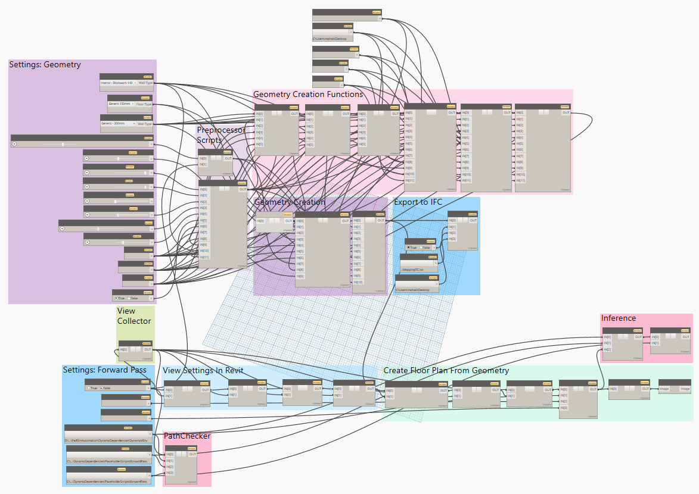
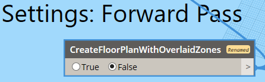

# PedSimAutomation Dynamo Script

This document details the dynamo script used in the repository [_PedSimAutomation_](https://github.com/patrickberggold/PedSimAutomation/).
A screenshot of the script is presented below. 

The script is divided into two code paths: _Geometry Creation_ and _Forward Pass_.
Switching between both paths can be done via the first setting of the Forward Pass path: _CreateFloorPlanWithOverlaidZones_, shown in a screenshot below. 

## Geometry Creation

The geometry creation section of this code is used to create Revit geometries. These geometries can then be exported as IFC files.

### Settings: Geometry

The input parameters for this section can be found in the group _Settings: Geometry_. These parameters are summarized below.

| Parameter                   | Description                                                                                                                                                                                          |
| :-------------------------- | :--------------------------------------------------------------------------------------------------------------------------------------------------------------------------------------------------- |
| Default Exterior Wall Types | Type used for external boundaries of geometry                                                                                                                                                        |
| Default Floor Types         | Type used for all floors (or ceilings) in geometry                                                                                                                                                   |
| Default Interior Wall Types | Type used for all interior walls of geometry                                                                                                                                                         |
| Geometry Shape              | Switch between the numbers to generate different geometries. Refer to the script for the geometry types. Note: Geometries 1, 2, and 3 can only be generated when the _Number of Levels_ is set to 1. |
| Number of Levels            | Number of levels in the geometry. Increasing the value of this variable beyond 1 will result in the generation of stairs for geometries 4, 5, and 6.                                                 |
| Length of Site              | Size of geometry in the x-direction (in meters)                                                                                                                                                      |
| Width of Site               | Size of geometry in the y-direction (in meters)                                                                                                                                                      |
| Height of Site              | **Deprecated:** **Height of each level is now a constant, equal to 2.5 meters.** Total height of geometry.                                                                                           |
| Corridor Width              | Width of corridor (in meters)                                                                                                                                                                        |
| Num. Rooms Short Side       | **Non-edge variants**: Number of rooms in the lower side. **Edge variants**: Length of room (in meters).                                                                                             |
| Num. Rooms Long Side        | **Non-edge variants**: Number of rooms in the upper side. **Edge variants**: Number of rooms per side.                                                                                               |
| Door Width                  | Width of door (in meters)                                                                                                                                                                            |
| Obstacle Width              | Width of obstacles (in meters)                                                                                                                                                                       |
| Room Width                  | Width of room (in meters)                                                                                                                                                                            |
| Include Bottleneck          | **Boolean**: Includes a bottleneck, i.e. an obstruction (either by a wall blocking a specific path or by reducing the available space for agents to pass through ) if set to _True_.                 |

### Preprocessor Scripts

This group comprises two scripts: _ModelSelector_ and _ParameterPreprocessor_.
_ModelSelector_ is used to prepare a list\<bool> with a length equal to the number of geometry types (6 in the latest version of this script), where all values are set to _False_ except for the index equal to the value of the input parameter _Geometry Shape_, as shown in the code snippet below,

```
geometry_list = [False for _ in range(6)] #for 6 geometry types
geometry_list[geometry_shape - 1] = True
```

> Note: The variable _geometry_shape_ is adjusted due to zero-based indexing.

This list is then used by the scripts in the group _Geometry Creation_. This group is discussed below.

The other script, _ParameterPreprocessor_, is used to group the input parameters presented in the previous section, starting from _Length of Site_ until (and including) _Include Bottleneck_, into a list.
This list, along with _txt_filename_ - a string; refer to the script for its definition - are set as the OUT variable.

### Geometry Creation

This group contains three scripts:

1. _HelperFunctions_

   This script contains commonly-used functions, e.g., two functions that convert a value from Revit units to meter, and vice versa.

2. _MultiLevelGeometryCreator_

   This script creates all levels in the geometry, as well as all the external walls and floor in each level.

3. _DetailCreator_

   This script adds the following to each level in the geometry:

   1. Staircases

      The number of staircases, their location and layout are dependent on the type of geometry selected by the user. Refer to the input parameter _Geometry Shape_.

      Three staircase layouts are used in this script, the functions which create them can be found in the script _HelperFunctions_.

   2. Level detail

      Detail in this case refers to the internal walls, corridors, and bottlenecks (explained in the first subsection of this section). These inner geometries are created by calling one of the geometry creation functions. These functions are detailed in the next subsection.

### Geometry Creation Functions

This group contains the functions used to create the inner geometries of each level in the model. The functions are housed in separate scripts, and take two arguments: the current level (_start_level_ in Dynamo) and the next level (_end_level_ in Dynamo). The remaining variables are provided as inputs to each python script.

Six scripts, containing six distinct geometry creation functions, can be found in this group. These are:

1. _EdgeCreationByLevel_
2. _CrossCreationByLevel_
3. _E2ECreationByLevel_
4. _NewCrossCreationByLeveL_
5. _NewEdgeCreationByLevel_
6. _AsymmEdgeCreationByLevel_

Notes to keep in mind:

- The first three cannot be used when creating multilevel geometries, as the staircase creation code did not take their dimensions into account; some staircases may be out of bounds, leading to null exceptions.
- Geometries 4 and 5 are multilevel versions of geometries 1 and 2, respectively. Moreover, additional features have been added to all multilevel geometries (geometries 4, 5, and 6), as they were implemented to generate a dataset that is similar to the TUM Gebaeude 3 model. These features include:
  - Randomly generated walls between rooms, allowing for a randomly varying room size. The layout is then exported as .txt file containing a binary list, where each $1$ denotes to a created wall, and each $0$ denotes to a skipped wall. This .txt file is generated for each level in the geometry, and can be used to later recreate the layout if needed.
  - A dictionary named _room_dict_, where all rooms are set as agent sources. This dictionary is a dictionary of dictionaries, where each level's sources are contained in a sub-dictionary named _Level{num}_, where {num} is the level's number, e.g., _Level_1_ is the first level's sub-dictionary.
  - Three types of staircases, resembling the staircases found in the TUM building (refer to the script)
  - Separation walls (instead of bottlenecks), which are more representative of the TUM building. Activation (or deactivation) of the walls can be done using the input parameter _Include Bottleneck_.

### Export to IFC

This group contains a script that can be used to export the Revit geometry as an .ifc file. Before using the script, make sure the _ExportDirectoryPath_ variable is set to a valid path on your machine.

It should be noted that this script does not work as intended. While the geometry is generated, $n-1$ additional levels - where $n$ is the original number of levels - are generated. The additional levels contain only the floor geometry separating each original level.

# Dimensions of TUM Gebaeude 3

This building has an L-shaped layout and overlooks two streets: Gabelsbergerstr. and Luisenstr. The dimensions of the building are as follows (in meters):

- Side overlooking Gabelsbergerstr.

  - Length: 99.18
  - Depth: 18.2

- Side overlooking Luisenstr.
  - Length: 65.66
  - Depth: 18.4
